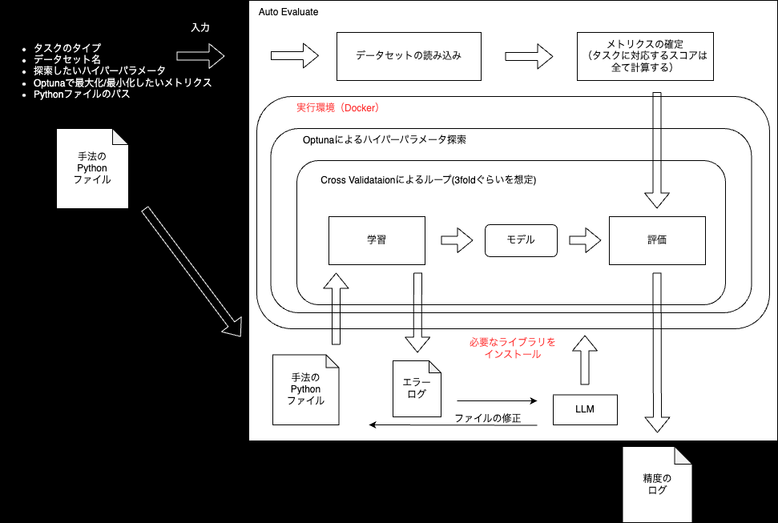

# AutoRes Evaluator

※ 追加で実装して欲しい機能や質問などがあれば以下のissuesから投稿をお願いします

https://github.com/auto-res/autores-evaluator/issues/new


## Examples
- A+Bのデータセットを試す用
<a href="https://colab.research.google.com/github/auto-res/autores-evaluator/blob/main/examples/A_B.ipynb" target="_blank" rel="noopener noreferrer"></a>

- Prediction by logistic regression on the Titanic dataset
<a href="https://colab.research.google.com/github/auto-res/autores-evaluator/blob/main/examples/logistic_regression.ipynb" target="_blank" rel="noopener noreferrer"></a>

- Prediction by CNN on CIFAR10
<a href="https://colab.research.google.com/github/auto-res/autores-evaluator/blob/main/examples/cnn.ipynb" target="_blank" rel="noopener noreferrer"></a>


## Architecture




## How to use
- Install
    - https://pypi.org/project/autoresevaluator/

```Python
pip install autoresevaluator

from autoresevaluator import AutoResEvaluator
```

- Setting
```python
# Hyperparameter setting
# Specify "type" and "args" for items to be searched in optuna.
params = {
    'lambda_l1': {'type': 'log_float', 'args': [1e-8, 10.0]},
    'lambda_l2': {'type': 'log_float', 'args': [1e-8, 10.0]},
    'num_leaves': {'type': 'int', 'args': [2, 256]},
    'feature_fraction': {'type': 'float', 'args': [0.4, 1.0]},
    'bagging_fraction': {'type': 'float', 'args': [0.4, 1.0]},
    'verbosity': -1
}

are = AutoResEvaluator(
    # LLM name ('gpt-4-turbo-preview', 'gemini-pro', 'claude-3-opus-20240229')
    llm_name='gpt-4-turbo-preview',
    # dataset name
    dataset_name='titanic',
    # parameter
    params=params,
    # Metrics you want to maximize/minimize
    valuation_index='roc_auc',
    # Where to store data
    datasave_path=None
    )
```

- Execution
```python
# model file path
model_path='/content/example.py',

are.exec(model_path)
```

## Output
- result.log
    - File to output the results

- model_error.log
    - File to write errors in model files
